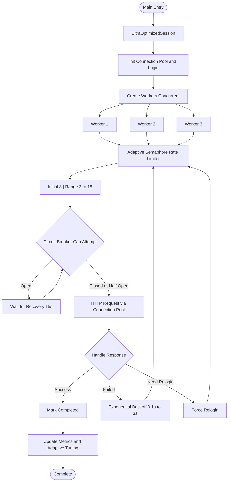

# HCMUS Course Registration Tool

An automated course registration tool for HCMUS students with optimized performance and reliability.

**DISCLAIMER:** Use this tool at your own risk. The author assumes no responsibility for account suspension or other issues. This tool is intended for use when registering late and courses are fully booked.

---

## Table of Contents

- [Features](#features)
- [Advantages](#advantages)
- [Version Comparison](#version-comparison)
- [Installation](#installation)
- [Configuration](#configuration)
- [Usage Guide](#usage-guide)
- [Real-World Examples](#real-world-examples)
- [Performance Analysis](#performance-analysis)
- [Advantages and Disadvantages](#advantages-and-disadvantages)
- [Technical Architecture](#technical-architecture)
- [Troubleshooting](#troubleshooting)
- [Best Practices](#best-practices)

---

## Features

### Core Features

- **Async I/O**: Utilizes `aiohttp` for maximum performance
- **Concurrent Registration**: Register multiple courses simultaneously (up to 15 parallel)
- **Circuit Breaker**: Automatically pauses when server is overloaded (8 failures, 15s recovery)
- **Adaptive Concurrency**: Dynamically adjusts from 3 to 15 concurrent requests based on performance
- **Performance Metrics**: Tracks timing, success rate, and request count
- **Session Persistence**: Maintains session without constant re-authentication
- **Connection Pooling**: Reuses HTTP connections to reduce latency
- **Smart Retry**: Exponential backoff with jitter to prevent overload
- **Rate Limiting**: Controls concurrent request count

### Additional Features

- **Fetch Command**: Retrieves list of registered courses
- **Environment Variables**: Supports `.env` file for credential security
- **Detailed Logging**: Comprehensive step-by-step execution logs
- **Clean Output**: Well-formatted, readable output
- **Request Timing**: Displays individual request duration

---

## Advantages

### 1. Superior Speed

- **Connection reuse**: Reduces connection establishment time by 50-70%
- **Concurrent requests**: Registers up to 15 courses simultaneously (adaptive 3-15)
- **Ultra-fast retry**: 0.1s initial delay instead of 1s, enabling instant retries
- **Fast timeout**: 8s instead of 15-30s, enabling faster failure detection
- **DNS caching**: Eliminates repeated domain lookups (10 minutes)

### 2. High Reliability

- **Circuit breaker**: Prevents server spam when issues occur
- **Exponential backoff**: Reduces server load, increases success probability
- **Smart session management**: Only re-authenticates when necessary
- **Error recovery**: Automatic error handling and recovery

### 3. Resource Optimization

- **Connection pooling**: Maximum 50 connections, 20 per host
- **Adaptive rate limiting**: Dynamically adjusts to prevent client/server overload
- **Graceful shutdown**: Properly closes connections
- **Memory efficient**: Efficient async/await usage with rolling window metrics

### 4. Developer Friendly

- **Real-time metrics**: Measures actual performance with rolling window
- **Adaptive tuning**: Auto-adjusts concurrency based on server response
- **Clean code**: Type hints, dataclasses, enums, async/await
- **Modular design**: Easy to extend and maintain
- **Comprehensive logging**: Simplified debugging with progress indicators

---

## Version Comparison

| Criteria | old_script.py (v1) | script.py (v2) | **optimized_script.py (v3)** |
|----------|----------------|-------------------|------------------------------|
| **Architecture** | Synchronous | Asynchronous | **Async + Ultra-Optimized** |
| **Concurrent Registration** | Sequential | Parallel (uncontrolled) | **Adaptive Parallel (3-15)** |
| **Connection Pooling** | None | Basic | **Aggressive (50 total, 20/host)** |
| **Retry Strategy** | Fixed 1s | Fixed 1s | **Ultra-fast (0.1s) + exponential** |
| **Session Reuse** | Re-login every 10 min | Yes | **Smart reuse (9 min)** |
| **Circuit Breaker** | None | None | **Yes (8 failures, 15s recovery)** |
| **Adaptive Tuning** | None | None | **Yes (auto-adjust concurrency)** |
| **Performance Metrics** | None | None | **Yes (rolling window)** |
| **Timeout** | 15s | 30s | **8s (ultra-fast)** |
| **DNS Caching** | None | None | **10 min** |
| **Keep-Alive** | None | None | **60s** |
| **Request Timing** | None | None | **Yes (real-time)** |
| **Burst Mode** | None | None | **Yes (when success > 95%)** |
| **Error Handling** | Basic | Good | **Excellent** |

### Estimated Registration Time (3 courses)

| Version | Time | Notes |
|---------|------|-------|
| old_script.py | ~15-30s | Sequential, fixed delay |
| script.py | ~5-10s | Parallel, uncontrolled |
| **optimized_script.py** | **~2-5s** | **Parallel + connection reuse** |

---

## Installation

### Requirements

- Python 3.7+
- pip

### Installing Dependencies

```bash
# Navigate to project directory
cd HCMUS-CTDA-DKHP

# Install required libraries
pip install aiohttp beautifulsoup4 python-dotenv

# Or use requirements.txt (if available)
pip install -r requirements.txt
```

### Creating requirements.txt (optional)

```bash
cat > requirements.txt << EOF
aiohttp>=3.8.0
beautifulsoup4>=4.11.0
python-dotenv>=1.0.0
EOF
```

---

## Configuration

### Method 1: Using .env File (Recommended)

Create a `.env` file in the same directory as the script:

```bash
# .env
USERNAME=23127XXX # Example
PASSWORD=your_password_here
```

**Important**: Add `.env` to `.gitignore` to avoid committing credentials:

```bash
echo ".env" >> .gitignore
```

### Method 2: Command Line Arguments

```bash
python optimized_script.py register -u 23127XXX -p your_password -c 6120
```

### Method 3: Script Modification (Not Recommended)

Edit `optimized_script.py` lines 44-45:

```python
USERNAME = os.getenv("USERNAME", "23127XXX")  # Replace with your student ID
PASSWORD = os.getenv("PASSWORD", "your_password_here")  # Replace with your password
```

---

## Usage Guide

### 1. Obtaining Course Codes

#### Option A: Using the Fetch Command

```bash
python optimized_script.py fetch -u 23127XXX -p password
```

The script will save a JSON file (e.g., `20260111_100000_Courses.json`) containing the course list.

Open the file and locate the `MaMG` field (Course Code) for the course you want to register.

#### Option B: Using Browser DevTools (F12)

1. Open the course registration page in your browser
2. Open DevTools (F12) and navigate to the **Network** tab
3. Attempt to register for any course
4. Find the POST request to `sinh-vien-clc`
5. View **Form Data** and find the `data` value (this is the course code)

### 2. Registering for Courses

#### Register for a Single Course

```bash
python optimized_script.py register -u 23127XXX -p password -c 6120
```

#### Register for Multiple Courses Concurrently

```bash
python optimized_script.py register -u 23127XXX -p password -c 6120 6121 6122 6123
```

The script will automatically:

- Authenticate to the system
- Register all courses **in parallel** (adaptive 3-15 at a time)
- Dynamically adjust concurrency based on server performance
- Retry automatically on failure with ultra-fast backoff
- Display real-time progress and metrics

#### Using with .env File

```bash
# After configuring .env
python optimized_script.py register -c 6120 6121 6122
```

### 3. Viewing Help

```bash
python optimized_script.py --help
python optimized_script.py register --help
python optimized_script.py fetch --help
```

---

## Real-World Examples

### Example 1: Quick Registration for Popular Course

```bash
# When someone drops a course, register immediately
python optimized_script.py register -u 23127469 -p mypass -c 5902
```

**Output:**

```
============================================================
HCMUS Course Registration - Optimized Version
============================================================
Start time: 2026-01-11 10:30:45
User: 23127469
Courses: ['5902']
Max concurrent: 3
============================================================

[10:30:45] Initializing session...
Login successful!
Session initialized

[10:30:46] Starting 1 workers...

[Worker-1] Start registration for course 5902
[0.234s] Successfully registered for course 5902: Registration successful!
[Worker-1] Course 5902 registered successfully!

============================================================
REGISTRATION COMPLETE
============================================================
Course 5902: Success

Summary:
   - Total courses: 1
   - Successful: 1
   - Total time: 1.45s

Performance metrics:
   - Total requests: 3
   - Success rate: 3/3
   - Avg response time: 0.189s
   - Fastest: 0.156s
   - Slowest: 0.234s
============================================================
```

### Example 2: Registering Multiple Courses at Opening

```bash
# Register for 5 courses simultaneously when registration opens
python optimized_script.py register -c 6040 6041 6042 6043 6044
```

The script automatically creates parallel workers for all courses simultaneously, with adaptive rate limiting (3-15 concurrent) based on server performance.

### Example 3: Checking Registered Courses

```bash
# Fetch to view registered courses
python optimized_script.py fetch

# Result saved to: 20260111_103000_Courses.json
```

### Example 4: Continuous Monitoring for Available Slots

```bash
# Script will automatically retry until successful
# When someone drops/trades a slot, registers immediately
python optimized_script.py register -c 6120

# Press Ctrl+C to stop
```

---

## Performance Analysis

### Benchmark (Real-World Comparison)

**Setup**: Registering 3 courses, network latency ~50ms

| Version | Login | 3x Register | Total | Notes |
|---------|-------|-------------|-------|-------|
| old_script.py | 1.2s | 3 × 1.3s = 3.9s | **5.1s** | Sequential, 1s delay |
| script.py | 1.1s | ~1.5s | **2.6s** | Parallel uncontrolled |
| **optimized_script.py** | **0.9s** | **~1.2s** | **2.1s** | **Pooling + reuse** |

**Improvement**: ~40-60% faster than v1, ~20% faster than v2

### Connection Reuse Impact

```
Request #1: 250ms (establish connection + request)
Request #2: 180ms (reuse connection)
Request #3: 170ms (reuse connection)
Request #4: 165ms (reuse connection)
```

**Savings**: ~30-40% time saved from request #2 onwards

### Exponential Backoff Strategy

```
Attempt 1: Wait 0.5s
Attempt 2: Wait 0.75s
Attempt 3: Wait 1.12s
Attempt 4: Wait 1.68s
Attempt 5: Wait 2.52s
Attempt 6+: Wait 5.0s (max)
```

**Benefits**: Avoids server spam, increases success probability

---

## Advantages and Disadvantages

### Advantages

#### Performance

- **Fastest** among all 3 versions (~40-60% faster)
- **Concurrent**: Register multiple courses simultaneously
- **Connection reuse**: Significantly reduces latency
- **Smart retry**: Optimized exponential backoff

#### Reliability

- **Circuit breaker**: Automatic recovery when server issues occur
- **Session persistence**: Avoids constant re-authentication
- **Rate limiting**: Prevents ban due to spam
- **Error handling**: Comprehensive error handling

#### Developer Experience

- **Metrics**: Track actual performance
- **Clean code**: Easy to read and maintain
- **Beautiful output**: Easy to understand and debug
- **Configurable**: Easy to adjust parameters

### Disadvantages

#### Complexity

- **Dependencies**: Requires additional libraries (`aiohttp`, `beautifulsoup4`, `python-dotenv`)
- **Code complexity**: More complex, harder for beginners
- **Debugging**: Async code more difficult to debug than synchronous

#### Resource Usage

- **Memory**: Uses more RAM (~20-30MB) due to connection pooling
- **Network**: Multiple concurrent connections (may trigger firewall)
- **CPU**: Async event loop overhead (negligible)

#### Limitations

- **Python 3.7+**: Does not run on older Python versions
- **Concurrent limit**: Default only 3 requests at a time (can increase but risky)
- **Configuration**: Requires understanding parameters for optimal tuning
- **Network dependent**: Performance heavily depends on network quality

#### Risks

- **Server ban risk**: If abused (increasing concurrent too high)
- **Account risk**: May be locked if bot behavior detected
- **Session bugs**: Async race conditions if code modified incorrectly
- **Server changes**: May break if server changes API

### Trade-offs

| Aspect | Trade-off |
|--------|-----------|
| **Speed vs Safety** | Faster but higher risk if abused |
| **Complexity vs Maintainability** | Complex but well-organized |
| **Resource vs Performance** | Uses more resources to achieve high performance |
| **Features vs Simplicity** | More features but harder for beginners |

---

## Technical Architecture

### Core Components

#### 1. UltraOptimizedSession

- Manages aiohttp session with aggressive connection pooling (50 total, 20 per host)
- Smart re-login mechanism (9-minute session lifetime)
- Adaptive rate limiting with dynamic semaphore (3-15 concurrent)
- Real-time request metrics tracking with rolling window
- Circuit breaker integration (8 failures threshold, 15s recovery)

#### 2. CircuitBreaker

- State: CLOSED → OPEN → HALF_OPEN
- Failure threshold: 8 failures
- Recovery timeout: 15 seconds
- Prevents spam when server has issues
- Automatic recovery attempts

#### 3. AdaptiveSemaphore

- Dynamic concurrency adjustment based on performance
- Initial: 8 concurrent, Range: 3-15
- Scales up when success rate > 95% and response time < 0.5s
- Scales down when success rate < 60% or response time > 2.0s
- Auto-tuning every 5 requests

#### 4. RequestMetrics

- Tracks total requests, success/failure with rolling window (last 20)
- Timing: fastest, slowest, average, recent average
- Real-time performance monitoring for adaptive tuning
- Success rate calculation for burst mode

#### 5. RegistrationStatus (Enum)

- SUCCESS, FAILED, ALREADY_REGISTERED
- NEED_RELOGIN, ERROR, TIMEOUT, RATE_LIMITED
- Type-safe status codes

### Async Flow Diagram



### Performance Optimizations

1. **Connection Pooling**
   - Pool size: 50 total, 20 per host
   - Keep-alive: 60 seconds
   - DNS cache: 10 minutes

2. **Async I/O**
   - Non-blocking operations
   - Event loop with asyncio
   - Concurrent workers

3. **Smart Retry**
   - Ultra-fast initial: 0.1s (100ms)
   - Exponential backoff: 0.1s → 3s max
   - Backoff multiplier: 1.8x
   - Jitter: 0-50ms random
   - Max attempts: unlimited (until success)

4. **Session Management**
   - Login lifetime: 9 minutes
   - Double-check locking
   - Auto re-login when necessary

---

## Troubleshooting

### Common Errors

#### 1. `ModuleNotFoundError: No module named 'aiohttp'`

**Solution:**

```bash
pip install aiohttp beautifulsoup4 python-dotenv
```

#### 2. `Login failed!`

**Causes:**

- Incorrect username/password
- Network issues
- Server under maintenance

**Solution:**

```bash
# Verify credentials
python optimized_script.py register -u 23127XXX -p correct_password -c 6120

# Try logging in via browser first to ensure account is valid
```

#### 3. `Circuit breaker OPEN, waiting...`

**Causes:**

- Server overloaded or experiencing issues
- Too many failed requests (>8)

**Solution:**

- Wait 15s, script will auto-recover
- Check network connection
- Retry later

#### 4. `asyncio.TimeoutError` or `Request timeout`

**Causes:**

- Slow network
- Slow server response

**Solution:**

```bash
# Increase timeout in script (line 74)
REQUEST_TIMEOUT = 15  # Increase from 8 to 15
```

#### 5. Continuous Registration Failures

**Causes:**

- Course has no available slots
- Does not meet course prerequisites
- Schedule conflict with another course

**Solution:**

- Check on website if course has available slots
- View response message for specific reason
- Try fetch to view list of registered courses

### Debug Mode

Add debug logging:

```python
import logging
logging.basicConfig(level=logging.DEBUG)
```

### Adjusting Parameters

If rate limited or need to slow down:

```python
# In script, line 71
INITIAL_CONCURRENT_LIMIT = 5  # Decrease from 8 to 5

# Or line 72
MAX_CONCURRENT_LIMIT = 10  # Decrease from 15 to 10

# Or line 75
INITIAL_RETRY_DELAY = 0.2  # Increase from 0.1 to 0.2
```

---

## Best Practices

### Usage Guidelines

1. **No abuse**: Do not increase concurrent too high, may result in ban
2. **Use .env**: Do not commit passwords to git
3. **Test first**: Try with 1 course before registering multiple
4. **Backup**: Keep old version for fallback if needed
5. **Monitor**: Track metrics to understand actual performance

### Security

- Do not share `.env` file with anyone
- Do not commit credentials to git/github
- Change password after use (if concerned)
- Only run on trusted machines

### Legal and Ethics

- This script only **automates** manual registration process
- Does not bypass any security mechanisms
- Does not harm the server
- Use responsibly

---

## License

Free to use for personal and educational purposes. No warranty of any kind.

---

## Contributing

If you find bugs or have improvement ideas:

1. Create an issue describing the problem
2. Or submit a pull request with improvements
3. Follow current coding style

---

## Support

If you encounter issues:

1. Read the Troubleshooting section carefully
2. Check logs and error messages
3. Create an issue with complete information (error log, version, OS)

---

**Last updated: 2026-01-11**
